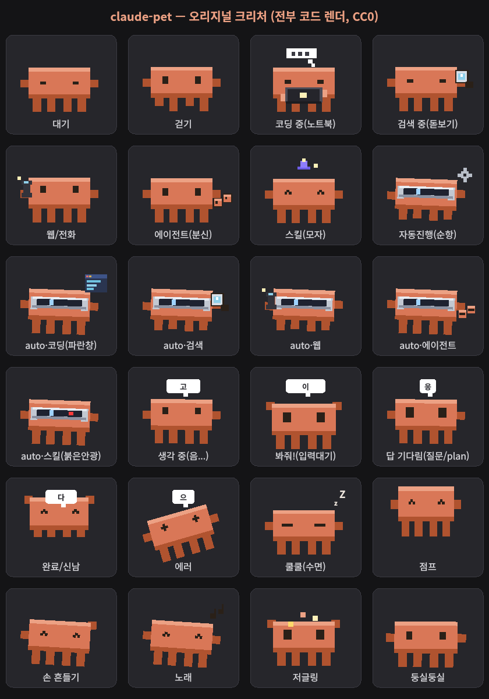

# claude-pet 🐾

[English](README.md) | **한국어**

**Claude Code**의 활동에 실시간으로 반응하는, 데스크톱 위에 사는 작은 픽셀 크리처예요.
평소엔 화면을 돌아다니다가, Claude가 작업을 시작하면 노트북 뒤에서 타이핑하고, 입력이
필요하면 말풍선을 띄우며 일어서요. 클릭하면 Claude Code 터미널을 앞으로 가져와요.

**KDE Plasma**에서 가장 잘 동작하지만, 크리처 자체는 PyQt6가 도는 곳이면 어디서든 실행돼요.
아트는 전부 코드로 그려서(이미지 에셋 없음) 자체 완결적이고 오리지널이에요 (아트 CC0).



## 상태

| 상태 | 모습 | 트리거 |
|------|------|--------|
| 대기 / 유휴 | 돌아다니다 졸음 (`z`) | 활성 도구 활동 없음 |
| 작업 중 | 도구별로: 노트북(편집), 돋보기(검색/읽기), 전화(웹/MCP), 분신(서브에이전트), 마법사 모자(스킬) | `PreToolUse` |
| 생각 중 | 고개 갸웃, "고민중…" 말풍선 | `UserPromptSubmit` |
| **주목** | 벌떡, "이거 맞아?" | 권한 요청 |
| **답 기다림** | 차분히 대기, "응?" | `AskUserQuestion` / `ExitPlanMode` |
| **자동진행** | VR 바이저 끼고 순항, auto/bypass 모드일 때 도구별 바이저 변형 | `permission_mode` auto/bypass |
| 완료 | 신난 점프, "다 됐다!" | 자리 비운 사이 작업 완료 |
| 에러 | 픽 쓰러짐, `X_X` | 실패한 턴 |
| 수면 | `Z` | 한동안 유휴 |

**창에 올라타고 함께 다니기**도 해요: 창 위에 올려두면 상단을 걷거나 안에서 지내고, 바탕화면으로
끌어내면 자유롭게 돌아다녀요. 올라탄 창이 가려지거나 최소화되면 펫도 같이 잘리거나 숨어요.

## 동작 원리

```
Claude Code ──훅──▶ claude-pet-hook ──유닉스 소켓──▶ 펫 (PyQt6 창)
```

- **`src/pet.py`** — 펫: 테두리 없고 반투명한 항상-위 창. 네이티브 Wayland는 클라이언트가
  자기 창 위치를 못 정해서, XWayland(`QT_QPA_PLATFORM=xcb`)로 실행해 자유롭게 배회해요.
- **`src/creature.py`** — 크리처 렌더러 (순수 `QPainter`, 상태 기반).
- **`bin/claude-pet-hook`** — Claude Code 훅 이벤트를 세션별 유닉스 소켓
  (`$XDG_RUNTIME_DIR/claude-pet-<세션>.sock`)으로 펫에 전달하고, `SessionStart` 때 펫을
  띄워요. Claude를 절대 막지 않아요.

## 요구사항

- Python 3 + PyQt6 — `pip install PyQt6`
- 전체 기능엔 **KDE Plasma**: `qdbus6`(창 통합/클릭-포커스), `wmctrl`(선택, 작업표시줄에서
  펫 숨김). Wayland면 XWayland.

## 플랫폼 지원

반응 코어(상태·애니메이션·배회·드래그/던지기·트레이)는 이식 가능하고, 창 통합(올라타기/가림·
클릭-포커스·작업표시줄 숨김)은 KDE 전용이라 그 외 환경에선 그냥 꺼져요 — 펫은 여전히 실행돼요.

| 플랫폼 | 실행 | 창 통합 |
|--------|------|---------|
| **KDE Plasma** (Wayland/X11) | ✅ | ✅ 전부 — 올라타기, 가림 클리핑/숨김, 클릭-포커스, 작업표시줄 숨김 |
| 기타 Linux (GNOME 등) | ✅ (XWayland) | ✖ KDE 전용 부분 no-op (배회/드래그/상태/트레이는 동작) |
| **macOS** | 🅱️ 실행될 것 (네이티브 Qt) | ✖ 미구현 — Cocoa 포커스/위치 레이어 필요 |
| **Windows** | 🚧 아직 | 훅↔펫 플러밍(bash 런처·AF_UNIX 소켓)이 Unix 전제 |

KDE만 실제로 테스트했어요. GNOME은 창 통합 범위 밖. 비-KDE에선 바탕화면 바닥으로 폴백하고
KDE 전용 기능은 전부 비활성화돼요.

### 각자 OS에서 테스트 도와주세요

macOS/Windows 경로는 best-effort고 **실기 미검증**이에요 — 리포트 환영. 돌려보면 확인 후 이슈로:

- **실행되나요?** `bin/claude-pet`로 크리처가 뜨고, 배회하고, 드래그/던지기가 되나요.
- **반응하나요?** `claude-pet-install-hooks` 후 Claude Code를 쓰면 상태가 바뀌나요
  (작업/생각/완료).
- **트레이** 아이콘과 메뉴가 뜨나요.
- **macOS 전용:** 좌클릭이 터미널/IDE(Terminal/iTerm/VS Code)를 앞으로 가져오나요(`osascript`).
  최전면 앱 감지가 "완료" 포즈를 게이팅하나요.
- 위 표 대비 뭐가 안 되는지 적어주세요 (올라타기/가림/작업표시줄 숨김은 설계상 KDE 전용).

## 설치

```bash
git clone <this-repo> ~/claude-pet
pip install PyQt6
~/claude-pet/bin/claude-pet-install     # 훅 + /claude-pet 스킬 (idempotent)
```

이후 새 Claude Code 세션은 펫을 자동으로 띄워요. 이미 돌아가던 세션은 재시작해야 훅을
인식해요 — 아니면 `~/claude-pet/bin/claude-pet`로 지금 하나 띄워도 돼요.

`claude-pet-install`이 세 가지를 해요: PyQt6 확인, `~/.claude/settings.json`에 훅 등록
(먼저 백업), `~/.claude/skills/`에 스킬 링크. 훅만 원하면: `bin/claude-pet-install-hooks`.

## `/claude-pet` 스킬

설치 스크립트가 이 스킬을 링크해줘요. 아무 세션에서 `/claude-pet`(또는 "펫 띄워")로 원할 때
펫을 띄워요 — 설치 전부터 열려 있던 세션이나, 닫힌 펫을 다시 부를 때 유용. 세션별 자동 실행은
훅이 담당해요.

훅만 설치했다면 수동 링크:

```bash
ln -s ~/claude-pet/skills/claude-pet ~/.claude/skills/claude-pet
```

## 인터랙션

- **드래그** — 집어서 던지면 중력으로 떨어지고 튕겨요. 창 안으로 던지면 내부 벽에 튕기고,
  밖으로 끌면 나와요.
- **좌클릭** — Claude Code 터미널(Konsole 등)을 앞으로.
- **우클릭 / 트레이** — 메뉴: *커서 따라오기* / *모션* 서브메뉴(점프·손흔들기·노래·저글링·축하) /
  *둥둥 띄우기*(무중력 토글) / *조용히(음소거)* / *종료*.
- **CLI/스킬 모션** — `/claude-pet <모션>` (또는 `bin/claude-pet-motion <모션>`):
  `jump`, `wave`, `sing`, `juggle`, `float`, 그리고
  `celebrate`/`thinking`/`sleeping`/`error`/`attention`; `list`, `stop`.

## 모션 매핑 커스터마이즈

어떤 Claude Code 활동에 어떤 모션을 보일지 `~/.config/claude-pet/config.json`에서 재매핑
(모든 키 선택):

```json
{
  "tools":      { "Bash": "work_search", "Grep": "sing", "*": "work_computer" },
  "events":     { "prompt": "thinking", "celebrate": "juggle" },
  "raw_events": { "PostToolUse": "celebrate", "SubagentStop": "wave" }
}
```

- `tools` — 도구명 → 상태. `"*"`는 매핑 안 된 도구의 폴백. `mcp__*`는 명시 안 하면 `work_web`.
- `events` — 이벤트 슬롯 → 상태. 슬롯: `start`, `prompt`, `done`, `celebrate`, `error`,
  `permission`, `idle_prompt`.
- `raw_events` — 슬롯 없는 원본 훅 이벤트명 → 상태 (`PostToolUse`, `SubagentStop`,
  `PreCompact` 등). 훅이 보내는 이벤트명만 알면 매핑 가능. 슬롯 있는 이벤트는 기본 동작 유지.

값은 알려진 상태/모션(`work_computer`, `work_search`, `work_web`, `work_agent`,
`work_skill`, `idle`, `sleeping`, `thinking`, `attention`, `error`, `celebrate`,
`jump`, `wave`, `sing`, `juggle`)이어야 하고, 모르는 값은 무시돼 기본값으로 폴백해요.
바꾸면 펫 재시작.

## 자동 시작

로그인 시 실행되도록 데스크톱 엔트리 복사:

```bash
cp ~/claude-pet/packaging/claude-pet.desktop ~/.config/autostart/
```

끄려면 그 파일 삭제.

## 제거

```bash
~/claude-pet/bin/claude-pet-install --remove    # 훅 + 스킬 링크 제거
rm ~/.config/autostart/claude-pet.desktop       # 자동시작 켰다면
rm -rf ~/claude-pet
```

## 라이선스

코드: MIT. 오리지널 아트(크리처): CC0.
