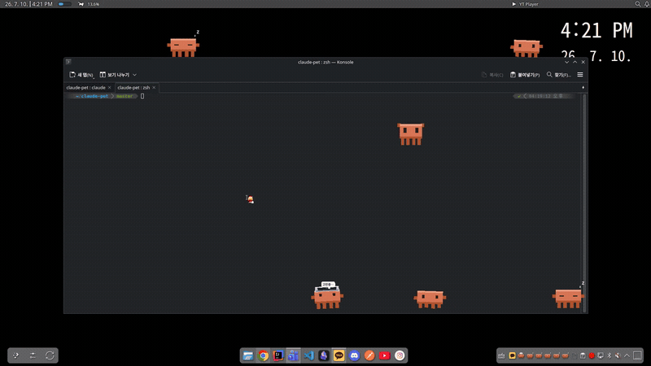
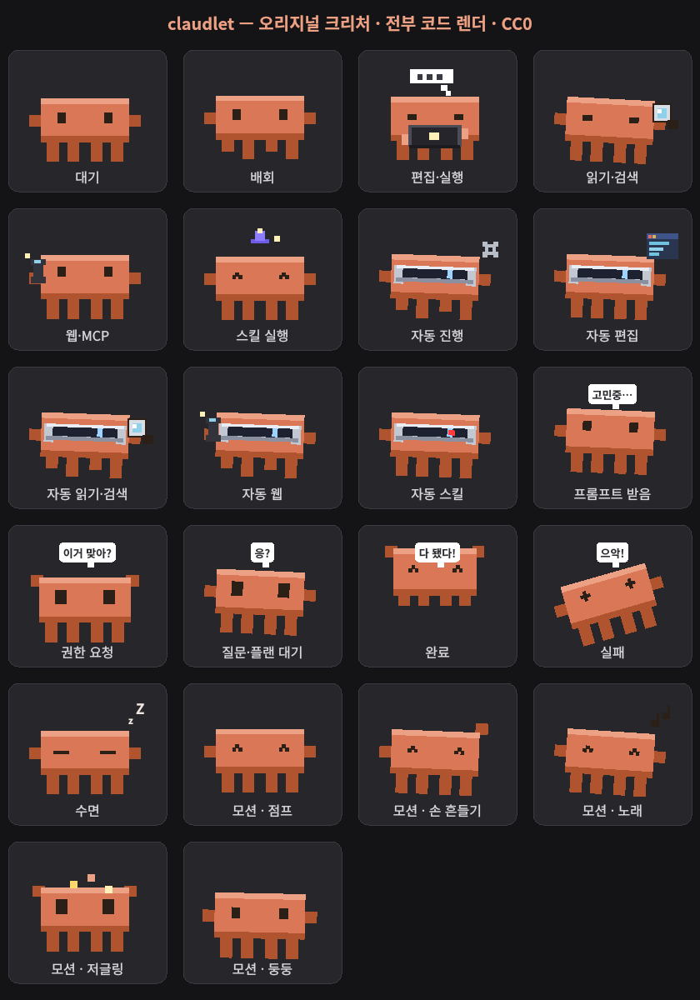
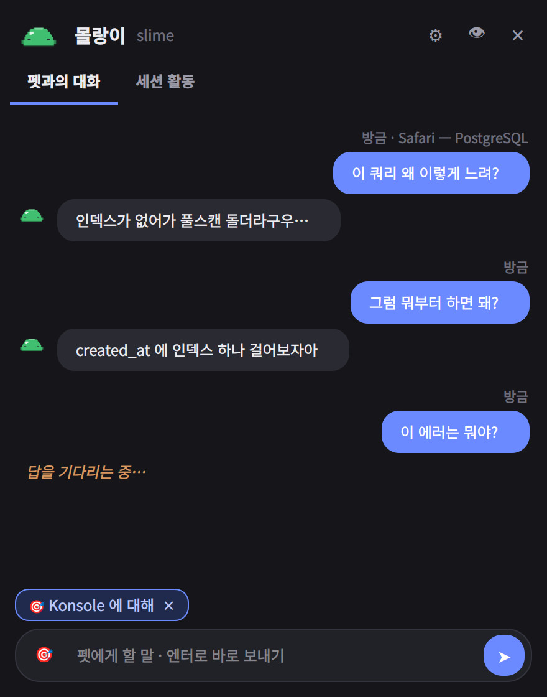
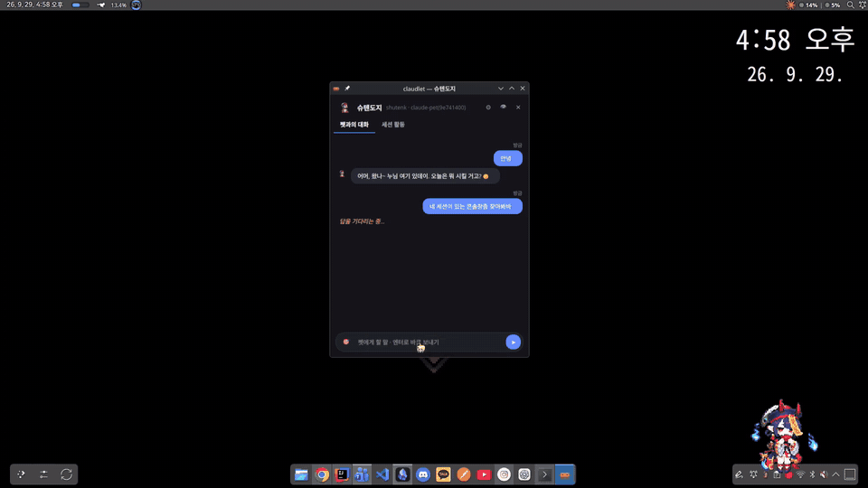
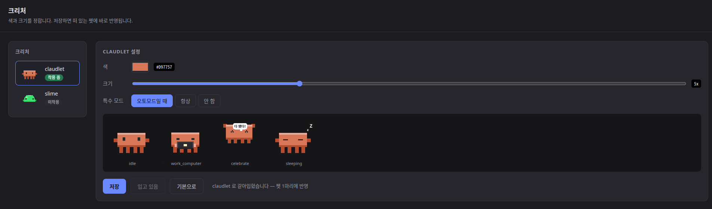
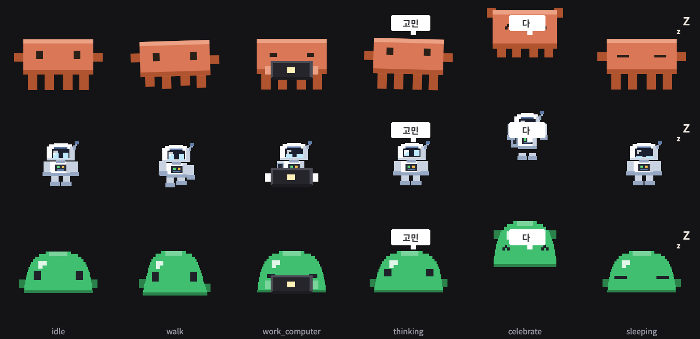

# claudlet 🐾

[English](README.md) | **한국어**

[](https://pypi.org/project/claudlet/)

**Claude Code**(와 Codex)의 활동에 실시간으로 반응하는, 데스크톱 위에 사는 작은 픽셀
크리처예요. 에이전트가 일하면 타이핑하고, 입력이 필요하면 기다리고, 끝나면 신나하고,
코딩하는 동안 화면을 돌아다녀요. 클릭하면 터미널을 앞으로 가져와요.

아트는 전부 코드로 그려서(이미지 에셋 없음) 자체 완결적이고 오리지널이에요 (아트 CC0).

<p align="center">
  <br>
  <em>실제 데스크톱 캡처 — 타이틀바에 올라타고, 작업 사이엔 졸고, 화면에 뭐가 떠 있든 그 위를 타고 다녀요.</em>
</p>

## 설치

```bash
pipx install claudlet
claudlet-install      # 감지된 에이전트 전부(Claude Code, Codex)에 훅 + /claudlet 스킬 등록
```

이후 새 세션은 펫을 알아서 띄워요. 이미 돌아가던 세션은 재시작하세요. **KDE Plasma**에서
가장 잘 되고, 창 위에 올라타기는 **Windows**·**macOS**에서도 돼요. 그 외 환경에선 그냥
돌아다녀요. → **[플랫폼 지원](docs/platform.ko.md)**

<details><summary>Codex</summary>

`claudlet-install` 은 찾은 에이전트 전부에 훅을 걸어요 — Claude Code는
`~/.claude/settings.json`, Codex는 `~/.codex/hooks.json` — 그리고 자기 항목만
손대요. 하나만 걸려면 `claudlet-install-hooks --agent codex` (`--remove` 로 제거).

Codex는 `~/.codex/config.toml`에 이게 있어야 훅을 실행해요:

```toml
[features]
hooks = true
```

Codex는 `Notification` 이벤트를 안 보내서, 권한 요청·유휴 알림 상태는 Codex의
`PermissionRequest`가 대신 맡아요.
</details>

<details><summary>업데이트</summary>

```bash
claudlet-version                                                                           # 설치본 vs 최신
pipx upgrade claudlet && claudlet-install                                                  # 최신 릴리즈
pipx install --force "git+https://github.com/YeeDochi/Claudlet@develop" && claudlet-install # develop 최신
```

끝나면 세션을 다시 시작해야(`claude --continue`) 새 훅이 로드돼요. 아니면
`/claudlet update`(develop은 `update latest`) 하고 안내 따라가면 돼요.
</details>

<details><summary>제거</summary>

**훅부터 떼고, 그다음 패키지 삭제** — `claudlet-uninstall`이 `~/.claude/settings.json`에서
훅을 떼는 유일한 단계라, 패키지를 먼저 지우면 Claude Code가 없어진 `claudlet-hook`을
계속 부르려 해요.

```bash
claudlet-uninstall        # 펫 종료 + 훅·스킬 해제 (--purge: 설정까지)
pipx uninstall claudlet   # 위 줄이 성공한 뒤에만
```

- **명령어를 못 찾음** (Windows에서 흔함): `pipx ensurepath` 후 터미널 재시작, 다시 실행.
- **소스 설치**: `python ~/claudlet/bin/claudlet-uninstall` 후 `~/claudlet` 삭제.
- **패키지를 먼저 지워버렸다면?** `pipx install claudlet && claudlet-uninstall && pipx uninstall claudlet`,
  아니면 `~/.claude/settings.json`에서 `claudlet-hook` 항목을 직접 지우세요.
</details>

<details><summary>pipx 없이 — 소스 한 줄 설치</summary>

`~/claudlet`로 클론(또는 업데이트)·의존성·훅+스킬 등록:
```bash
curl -fsSL https://raw.githubusercontent.com/YeeDochi/Claudlet/master/install.py | python3 -   # Linux / macOS
```
```powershell
irm https://raw.githubusercontent.com/YeeDochi/Claudlet/master/install.py | python -           # Windows
```

이 방식은 `claudlet*` 명령이 PATH가 아니라 `~/claudlet/bin`에 있어요. 훅은 그대로
동작하고, 명령을 직접 치려면 그 디렉터리를 PATH에 추가하세요.
</details>

## 뭘 보여주나요

포즈가 에이전트가 지금 뭘 하는지를 따라가요 — 편집·읽기·MCP 호출·생각·입력 대기·완료·실패.
혼자 알아서 돌아갈 때(auto/bypass 모드)는 VR 바이저를 눈 위로 내려 써요.

<p align="center">
  
</p>

에이전트가 **서브에이전트**를 띄우면 하나당 모자 쓴 컴패니언(최대 3마리)이 펫을 졸졸
따라다니며 그 작업을 따라 하고, 끝나면 인사하고 떠나요.

<p align="center">
  
</p>

## 말 걸기

**우클릭 → 💬 대화 시작…** 하면 대화창이 떠요. **엔터**는 친 말을 그대로 세션에 넣고,
**➤ 우클릭 → 📝 쪽지로 남기기** 는 펫이 쪽지를 입에 물고 있다가 다음 툴 호출이나
프롬프트에 실어 보내요. **🎯** 로 창을 드래그하면 그 창 내용이 다음 말과 같이 가요.

답은 크리처의 목소리로 머리 위 말풍선에 떠요 — 크리처마다 이름과 말투를 따로 줄 수
있어요(설정 페이지).

<p align="center"></p>

<details><summary>플랫폼별 참고</summary>

- **KDE**: 바로 보내려면 Konsole 설정의 *보안에 민감한 DBus API 활성화* 가 켜져 있어야
  해요. 아니면 엔터가 쪽지로 남겨져요(입력칸에 그렇게 적혀요).
- **macOS**: 아직 쪽지만 돼요.
- **리눅스 한글 입력(fcitx)**: pip 로 깔린 Qt 에는 fcitx 입력기가 없어요. 배포판
  PyQt6(`sudo apt install python3-pyqt6`)가 있으면 펫이 그쪽 Qt 로 다시 떠서 한글이 돼요.
</details>

## 창 찾아오기

창 열 개 뒤에 묻혔거나 최소화한 창이 있나요? 에이전트한테 "슬랙 창 꺼내줘" 하면
**펫이 그 앱 아이콘을 물고 가서 가져와요**. 최소화된 창은 펫이 서 있던 자리로 올라오고,
가려진 창은 펫이 붙잡고 낑차낑차 끌고 와요.

<p align="center"></p>

KDE Plasma와 Windows에서 돼요. macOS 에선 최소화된 창이 목록에 안 나오고 앱 전체를
앞으로 가져와요.

## 내 맘대로 꾸미기

`/claudlet setting`(또는 `claudlet-config ui`)을 치면 **어떤 크리처를 입힐지**와
**색·크기**를 고르는 페이지가 열려요. 진짜 렌더러로 미리 보여주고, 에이전트가 둘 이상이면
에이전트마다 탭이 생겨요.

<p align="center"></p>

기본으로 네 마리가 들어 있고, `/claudlet make <원하는 것>` 으로 새로 만들 수 있어요
(`/claudlet make 검은 고양이`):



크리처는 작은 파이썬 패키지라서 사각형으로 그리든 스프라이트 시트를 찍든 마음대로예요 —
**[크리처 만들기](src/claudlet/skill/creature-authoring.md)** 참고. 설정 페이지의 화살표
버튼으로 zip 내보내기·가져오기를 하고, 가져올 땐 남의 코드를 돌리는 거라 설치 전에
내용물을 먼저 보여줘요.

## `/claudlet`

`claudlet-install` 이 `/claudlet` 스킬을 찾은 에이전트 전부에 링크해줘요:

- `/claudlet` — **이** 세션에 펫 붙이기 · `/claudlet standalone` — 세션에 안 붙은 펫
- `/claudlet <모션>` — `jump` · `wave` · `sing` · `juggle` · `float` · `celebrate` · … (`list`, `stop`)
- `/claudlet setting` · `wear <크리처>` · `make <설명>` · `export` / `import`
- `/claudlet config` — 아니면 그냥 말로("Bash 돌 때 점프하게")
- `/claudlet window <무엇>` — 창을 찾아 펫이 가져와요
- `/claudlet update`

<details><summary>셸 명령어</summary>

| 명령어 | 하는 일 |
|---|---|
| `claudlet` | 펫 바로 실행 (standalone). |
| `claudlet-install` | 훅 + `/claudlet` 스킬 등록 — 설치 후 한 번 실행. |
| `claudlet-uninstall` | 펫 종료 + 훅·스킬 해제 + 정리 (`--purge`면 설정도 삭제). |
| `claudlet-config` | 사용자 설정 보기/생성/열기 (`--path`, `init`, `open`). `ui` 는 겉모습 페이지 (`--app` 은 자기 창으로, `--agent <이름>` 은 그 에이전트 화면으로). |
| `claudlet-config wear <크리처>` | 크리처 갈아입히기. `--agent <이름>` 이면 그 에이전트만. 인자 없이 치면 목록. |
| `claudlet-config export <크리처>` | 크리처를 zip 으로 내보내기 (`--out <폴더\|파일.zip>`, `--force` 덮어쓰기). |
| `claudlet-config import <파일.zip>` | 받은 크리처 설치 — 내용물을 먼저 보여줘요 (`--yes` 확인 생략, `--force` 같은 이름 교체). |
| `claudlet-version` | 설치된 버전 vs PyPI 최신 릴리즈 표시. |
| `claudlet-attach` | 현재 Claude Code 세션에 펫 붙이기. |
| `claudlet-motion <이름>` | 실행 중인 펫에 모션 재생 (`jump`, `wave`, … ; `stop`, `list`). |
| `claudlet-install-hooks` | `claudlet-install`의 훅 부분만 (`--agent codex`로 좁히기, `--remove`로 취소). |
| `claudlet-window` | 창 `list` (JSON, 맨 위부터), `raise <id>` (`--wait`, `--pull`), `chat` 은 펫 대화창. |
| `claudlet-doctor` | 뭐가 꺼져 있어서 뭐가 안 되는지 알려줘요 (`--quiet`: 문제 있을 때만). |
| `claudlet-macos-diag` | macOS 창 좌표 원본 출력 (perch 문제 진단). |
| `claudlet-hook` | 내부용 — 에이전트 훅이 호출, 직접 쓰는 게 아님. |
</details>

## 문서

- **[사용법 & 인터랙션](docs/usage.ko.md)** — 드래그/던지기, 클릭-포커스, 트레이 메뉴, 모션, 자동시작
- **[설정](docs/configuration.ko.md)** — 어떤 활동에 어떤 애니를 보일지 재매핑
- **[크리처 만들기](src/claudlet/skill/creature-authoring.md)** — 계약, 크리처가 물려받는 모션·프롭 도구, 렌더링 함정
- **[플랫폼 지원](docs/platform.ko.md)** — 지원 매트릭스 + 각 OS 테스트 방법
- **[기여 가이드](CONTRIBUTING.ko.md)** — 개발 환경, 테스트, 브랜치 모델
- **[변경 이력](https://github.com/YeeDochi/Claudlet/releases/latest)**

## 기여자

- **[@htto0824](https://github.com/htto0824)** — 도크 배치(코너 슬롯, 여러 마리
  나란히 세우기, 드래그로 대열 이동), Windows Terminal 탭 포커스
- **[@Rio-Kyeong](https://github.com/Rio-Kyeong)** — 아트픽셀을 정수 픽셀 그리드에
  맞춘 렌더(선명한 테두리, bob 중에도 실루엣이 출렁이지 않음)
- **[@pawprint0706](https://github.com/pawprint0706)** — Windows 픽스: 금지구역
  편집 오버레이가 마우스 입력을 전혀 받지 못하던 문제, 스킬 링크 정션을 매번
  경고하던 문제
- **[@reujea](https://github.com/reujea)** — 포인터로 화면을 가리켜 묻기(창의
  텍스트를 읽어 마스킹한 뒤 승인받고 보냄), 주고받은 대화 내역

## 라이선스

코드: **MIT** ([LICENSE](LICENSE)). 크리처 아트: **CC0** ([NOTICE](NOTICE)).
