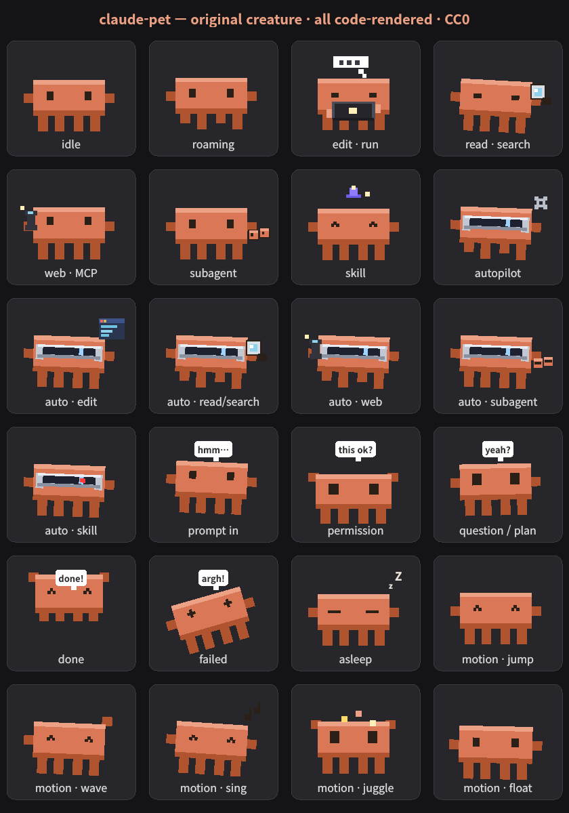
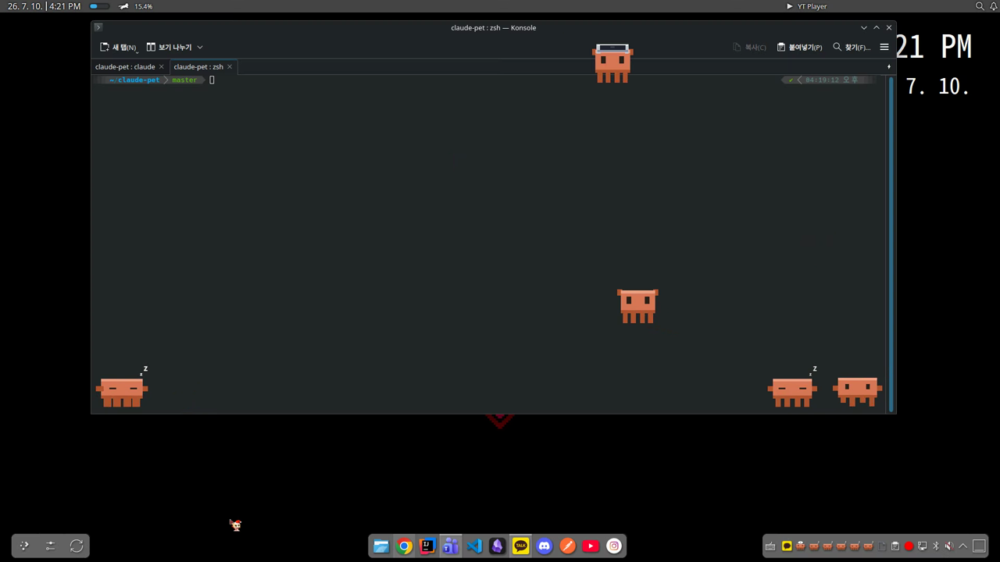
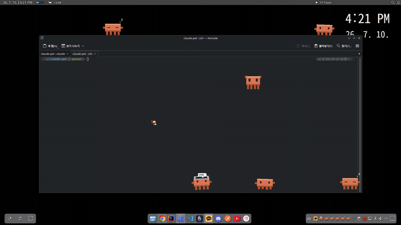
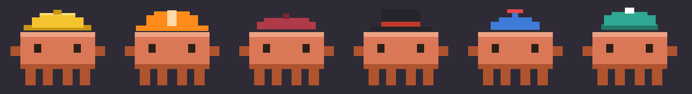
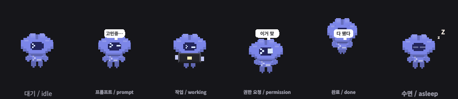
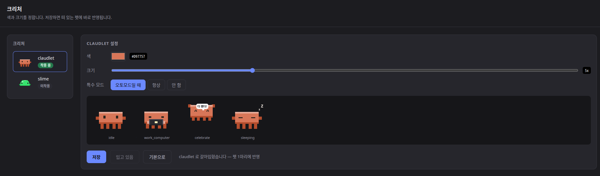
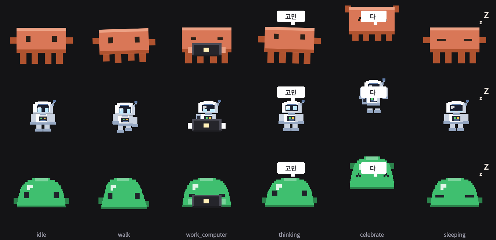
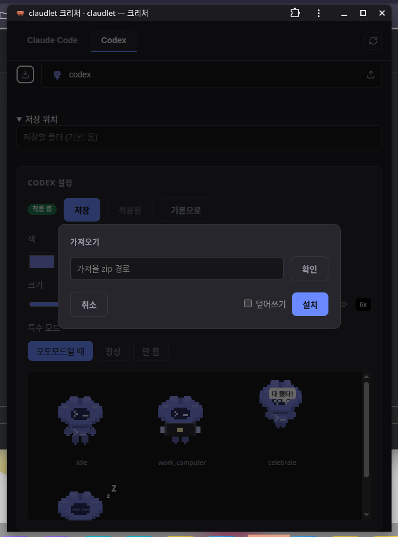

# claudlet 🐾

**English** | [한국어](README.ko.md)

[](https://pypi.org/project/claudlet/)

A tiny pixel creature that lives on your desktop and reacts to **Claude Code** in
real time — it types while Claude works, waits when Claude needs you, celebrates
when it's done, and roams around while you code. Click it to bring the terminal
back to the front.

Drawn entirely in code — no image assets — so it's self-contained and original
(CC0 artwork).

<p align="center">
  
</p>

## See it in action

Real desktop capture. Pets perch on the terminal titlebar, roam the desktop, doze
off (💤) between tasks, and clamber over whatever else is on screen.

<p align="center">
  
</p>

<p align="center">
  <br>
  <em>Real desktop capture — they wander over whatever else is on your screen.</em>
</p>

### Agent companions

When Claude spawns **subagents**, a little hard-hatted sidekick trails your pet
for each one — a duckling chain that follows it around, mirrors what the
subagent is doing, and waves goodbye when its agent finishes.

<p align="center">
  <br>
  <em>Real desktop capture — two subagents, two hatted companions trailing the session's pet.</em>
</p>

<p align="center">
  
</p>

Each companion wears a random hat so you can tell them apart:

<p align="center">
  
</p>

## Install

Install with [pipx](https://pipx.pypa.io) (an isolated app install — pulls the
deps, incl. `pyobjc-framework-Quartz` on macOS, and puts the `claudlet*`
commands on your PATH), then wire it into Claude Code:

```bash
pipx install claudlet
claudlet-install      # hooks + /claudlet skill, for every agent found (idempotent)
```

`claudlet-install` registers the hooks for **each agent it finds** and links the
`/claudlet` skill into that agent's own skills folder (`~/.claude/skills`,
`~/.codex/skills`). On Linux it also drops a desktop entry and icon for the
settings app.

### Other agents (Codex)

claudlet isn't Claude-Code-only. `claudlet-install` (and `claudlet-install-hooks`)
registers hooks for **every agent it finds** — Claude Code via
`~/.claude/settings.json`, Codex via `~/.codex/hooks.json`. Narrow it when you
want just one:

```bash
claudlet-install-hooks --agent codex          # only Codex
claudlet-install-hooks --agent claude,codex   # both, explicitly
claudlet-install-hooks --remove --agent codex # unhook just Codex
```

Codex runs hooks only when `~/.codex/config.toml` has:

```toml
[features]
hooks = true
```

Other apps' hook entries in those files are left alone — claudlet only ever
touches its own.

A Codex session's pet wears the **codex** creature by default — a cloud-headed
mascot whose face is a terminal prompt:



When more than one agent is detected, the settings page (`claudlet-config`) grows
an agent row, so Claude Code and Codex can wear **different creatures**.

One difference worth knowing: Codex sends no `Notification` event, so the states
Claude Code drives through it (permission prompt, idle nudge) don't fire for
Codex — its own `PermissionRequest` covers the permission case instead.

Check your version with `claudlet-version` (installed vs latest release). Update
to the newest **release** with `pipx upgrade claudlet && claudlet-install`, or to
the tip of **develop** (edge) with `pipx install --force "git+https://github.com/YeeDochi/Claudlet@develop" && claudlet-install`.
Either way, restart your Claude Code session afterward (`claude --continue`) so the
new hooks + pet code load. Or just run `/claudlet update` (release) /
`/claudlet update latest` (master) from inside Claude Code and follow the prompts.

To uninstall, **order matters — unhook first, then remove the package.**
`claudlet-uninstall` is the *only* step that removes the hooks from
`~/.claude/settings.json`; if you delete the package first, those hooks linger and
Claude Code keeps trying to run a `claudlet-hook` that no longer exists.

```bash
claudlet-uninstall        # stops pets, unregisters the hooks + /claudlet skill
                          #   (add --purge to also delete your config)
pipx uninstall claudlet   # only after the line above succeeds
```

<details><summary>If <code>claudlet-uninstall</code> isn't found, or you installed from source</summary>

**Command not found (common on Windows).** The `claudlet*` commands live in pipx's
bin directory; if it isn't on your PATH the shell can't find them. The fix:
```
pipx ensurepath        # add pipx's bin dir to PATH
```
Then **restart your terminal** and run `claudlet-uninstall` again. (`pipx list`
prints the exact install location if you'd rather run the script by full path.)

**Source install** (the `install.py` one-liner clones to `~/claudlet` — there's no
pip package to remove). Run the checkout's own script, then delete the folder:
```bash
python ~/claudlet/bin/claudlet-uninstall
rm -rf ~/claudlet                                   # Windows: rmdir /s "%USERPROFILE%\claudlet"
```

**Already removed the package without unhooking?** The hook entries are still in
`~/.claude/settings.json`. Reinstall just long enough to unhook cleanly:
```
pipx install claudlet && claudlet-uninstall && pipx uninstall claudlet
```
or open `~/.claude/settings.json` and delete the `claudlet-hook` entries by hand.
</details>

<details><summary>Without pipx — one-line source install</summary>

Clones (or updates) to `~/claudlet`, installs deps, registers hooks + skill:
```bash
# Linux / macOS
curl -fsSL https://raw.githubusercontent.com/YeeDochi/Claudlet/master/install.py | python3 -
```
```powershell
# Windows (PowerShell)
irm https://raw.githubusercontent.com/YeeDochi/Claudlet/master/install.py | python -
```

Unlike pipx, this does **not** put the `claudlet*` commands on your PATH — they
live in `~/claudlet/bin`. The hooks still work (Claude Code calls them by full
path), but to run `claudlet`, `claudlet-config`, `/claudlet update`, etc.
yourself, add that dir to your PATH:
```bash
# Linux / macOS — add to ~/.bashrc or ~/.zshrc, then restart the shell
export PATH="$HOME/claudlet/bin:$PATH"
```
```powershell
# Windows (PowerShell) — persist for your user, then restart the terminal
setx PATH "$env:USERPROFILE\claudlet\bin;$env:PATH"
```
</details>

New Claude Code sessions then auto-spawn a pet. Restart any already-running session
to pick up the hooks — or launch one now with `claudlet`.

Best on **KDE Plasma**. Perching on and riding windows also works on **Windows**
(Win32) and **macOS** (needs `pyobjc-framework-Quartz`, which the installer adds
automatically; the pet self-calibrates window coordinates at runtime) — all three
are hardware-verified. Elsewhere the window tricks switch off gracefully and the
pet just roams. See **[Platform support](docs/platform.md)**.

## What it shows

The creature's pose tracks what Claude is doing — editing, reading, calling MCP,
thinking, waiting on your input, celebrating (see the sheet above). While Claude
runs **unattended** (auto / bypass mode) it shows that too — the built-in pulls
a VR visor down over its eyes. It also **perches on and rides your windows** —
walking along the top or living inside — and clips/hides when the window it's on
is covered or minimized.

When Claude runs **subagents**, a hatted **companion** appears for each one (up to
three) and trails the pet in a duckling chain, mirroring the subagent's activity
and leaving with a little celebration when it finishes — so you can see agent work
happening at a glance.

## Make it yours



`/claudlet setting` (or `claudlet-config ui`) opens a page where you pick
**which creature** the pet wears and, for each one, its **colour** and **size**.
Every creature is previewed with the real renderer, so what you see is what lands
on the desktop. Settings belong to the creature, so dressing one never repaints
another.

When more than one agent is installed, the page gets **a tab per agent** — Claude
Code and Codex can wear different creatures. Prefer the command line?
`claudlet-config wear <creature> [--agent codex]` switches it without opening
anything, and running pets change at once.

The page is served locally on a fixed port and opens in your ordinary browser. It
also ships a web-app manifest, so you can **install it** from your browser's menu;
after that it opens as its own window, and `claudlet-config ui --app` gives you
that window without installing.

A creature is a small package, not a data file — the pet tells it which state to
be in and everything about how that looks is inside. `/claudlet make <what you
want>` writes one for you:

```
/claudlet make 검은 고양이
/claudlet make a grumpy little robot
```

It lands in `~/.config/claudlet/creatures/<name>/` and shows up in the settings
list. Four ship with the pet:



**codex** is the one a Codex session's pet wears by default; the other two are
there as **worked examples**, and neither is shaped like the built-in:

- **astronaut** — a humanoid. Helmet, torso, two arms, two legs, a pack on its
  back. Its arms hang from fixed shoulders and the *hands* move, and it answers
  the unattended flag with a lit visor and a blinking antenna rather than a
  headset.
- **slime** — no legs at all. A stride becomes a hop, and a lean is a shear
  rather than a rotation, because rotating a stack of thin slabs smears every
  edge.

Both still think, type and sleep, because the motion and the props come from the
pet, not from the creature — a creature only draws a body. Read either one next
to [creature-authoring.md](src/claudlet/skill/creature-authoring.md) if you are
writing your own.

A creature does not have to be drawn with rectangles at all. The pet sends a
state and a frame and asks nothing else, so one can keep its frames as DATA — a
character per dot against a palette — and blit them. At the size where a face is
a dozen dots that is the difference between a face and a suggestion of one:


That one carries sixty frames cut from sprite sheets: a stride facing each way,
a run, whole-body expressions, a sleeping pose, and hair that catches fire while
it works unattended. The steps — and the traps, which are specific and
expensive — are in **Creatures made from a sprite sheet** in the authoring
guide.

### Sharing a creature



The arrow buttons beside the creature bar export the one you are looking at as a
`.zip`, and import one someone sent you (`claudlet-config export <creature>` /
`import <file.zip>` do the same from a shell).

Importing runs someone else's Python on your machine — the pet imports the
package at startup — so it is deliberately a two-step: claudlet shows you what is
inside the archive and installs nothing until you say go. Archives that try to
escape the target directory, hide a symlink, carry control characters in a
filename, or weigh more than a creature plausibly can are refused outright, and an
install that fails leaves the creature you already had untouched.

## Commands

`pipx install claudlet` puts these on your PATH:

| Command | What it does |
|---|---|
| `claudlet` | Launch a pet right now (standalone). |
| `claudlet-install` | Register the hooks + `/claudlet` skill in Claude Code — run once after installing. |
| `claudlet-uninstall` | Stop pets, unregister the hooks + skill, clean up (`--purge` also deletes your config). |
| `claudlet-config` | Show / scaffold / open the user config (`--path`, `init`, `open`); `ui` opens the appearance page (`--app` for a window of its own, `--agent <name>` to open on that agent). |
| `claudlet-config wear <creature>` | Put a creature on, `--agent <name>` for one agent only; no argument lists what is available. |
| `claudlet-config export <creature>` | Zip a creature to share (`--out <dir\|file.zip>`, `--force` to overwrite). |
| `claudlet-config import <file.zip>` | Install a creature someone shared, after showing you what is inside (`--yes` to skip the prompt, `--force` to replace one of the same name). |
| `claudlet-version` | Show the installed version vs the latest PyPI release. |
| `claudlet-attach` | Attach a pet to the current Claude Code session. |
| `claudlet-motion <name>` | Play a motion on running pets (`jump`, `wave`, … ; `stop`, `list`). |
| `claudlet-install-hooks` | Just the hooks half of `claudlet-install`, for every detected agent (`--agent codex` to narrow, `--remove` to undo). |
| `claudlet-macos-diag` | Print raw macOS window coordinates (perch troubleshooting). |
| `claudlet-hook` | Internal — invoked by Claude Code's hooks, not by you. |

### The `/claudlet` skill

`claudlet-install` links a `/claudlet` skill into **every agent it found**, so you
can drive the pet straight from a prompt — in Claude Code or in Codex:

- `/claudlet` — attach a pet to **this** session (so it reacts to the session's activity)
- `/claudlet standalone` — an unattached, decorative pet
- `/claudlet <motion>` — `jump` · `wave` · `sing` · `juggle` · `float` · `celebrate` · `thinking` · `sleeping` · `error` · `attention` (plus `list`, `stop`)
- `/claudlet setting` — appearance: which creature, and its colour / size / unattended look
- `/claudlet wear <creature> [for <agent>]` — put a creature on, for this agent or a named one
- `/claudlet export <creature>` / `/claudlet import <path>` — share a creature as a zip (an import shows you what is inside first)
- `/claudlet make <description>` — write a new creature for the pet to wear
- `/claudlet config` — show the config, or just ask in plain language ("jump when I run Bash") and Claude edits it for you
- `/claudlet update` — update to the latest release (`update latest` for the tip of develop); shows your version and walks you through it

## Docs

- **[Usage & interaction](docs/usage.md)** — drag & throw, click-to-focus, tray menu, motions, autostart, uninstall
- **[Configuration](docs/configuration.md)** — remap which animation shows for which Claude Code activity (run `claudlet-config` or `/claudlet config` to locate & inspect it)
- **[Writing a creature](src/claudlet/skill/creature-authoring.md)** — the contract, the motion/prop tools a creature inherits, and the rendering mistakes worth skipping
- **[Platform support](docs/platform.md)** — support matrix + how to test on your OS
- **[Contributing](CONTRIBUTING.md)** — dev setup, running tests, code style, branch model
- **[Changelog](https://github.com/YeeDochi/Claudlet/releases/latest)** — what changed in each release (English + Korean)

## Contributors

- **[@htto0824](https://github.com/htto0824)** — dock placement (corner slots,
  multi-pet alignment, drag-to-move the whole row) and Windows Terminal tab focus
- **[@Rio-Kyeong](https://github.com/Rio-Kyeong)** — art pixels snapped to the
  whole-pixel grid (crisp edges, no silhouette wobble as the pet bobs)
- **[@pawprint0706](https://github.com/pawprint0706)** — Windows fixes: the
  no-go zone editor took no mouse input at all, and skill-link junctions were
  re-warned about on every install

## License

Code: **MIT** (see [LICENSE](LICENSE)). Creature artwork: **CC0** (see [NOTICE](NOTICE)).
