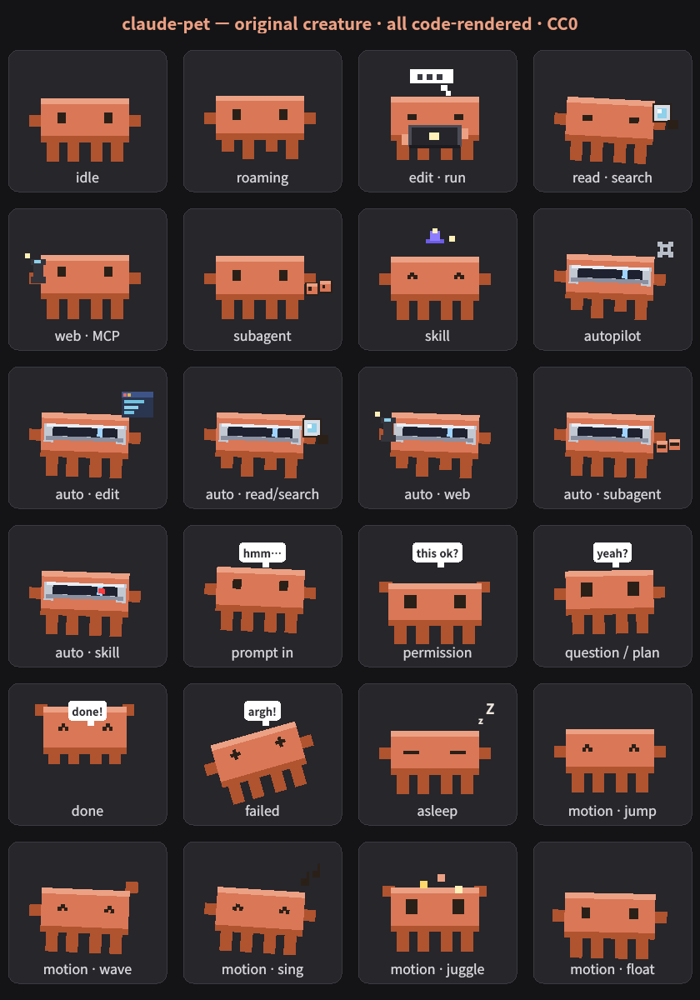
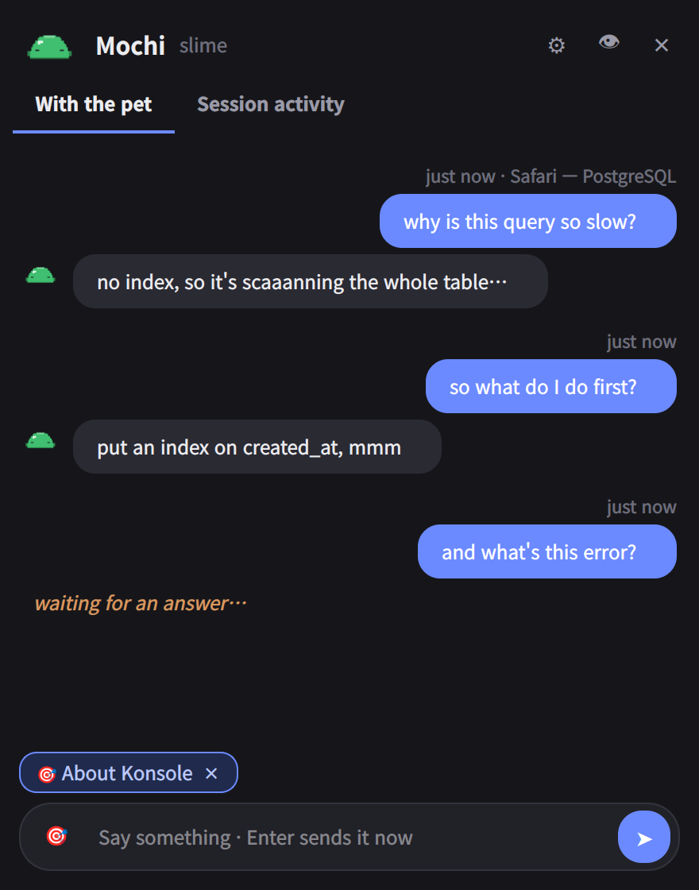

# claudlet 🐾

**English** | [한국어](README.ko.md)

[](https://pypi.org/project/claudlet/)

A tiny pixel creature that lives on your desktop and reacts to **Claude Code**
(and Codex) in real time — it types while the agent works, waits when it needs
you, celebrates when it's done, and roams around while you code. Click it to
bring the terminal back to the front.

Drawn entirely in code — no image assets — so it's self-contained and original
(CC0 artwork).

<p align="center">
  <br>
  <em>Real desktop capture — perching on titlebars, dozing off between tasks, climbing over whatever's on screen.</em>
</p>

## Install

```bash
pipx install claudlet
claudlet-install      # hooks + /claudlet skill, for every agent found (Claude Code, Codex)
```

New sessions then spawn a pet on their own; restart sessions that were already
running. Best on **KDE Plasma**; perching on windows also works on **Windows**
and **macOS**, and elsewhere the pet just roams. See
**[Platform support](docs/platform.md)**.

<details><summary>Codex</summary>

`claudlet-install` hooks every agent it finds — Claude Code via
`~/.claude/settings.json`, Codex via `~/.codex/hooks.json` — and only ever
touches its own entries. Narrow it with `claudlet-install-hooks --agent codex`
(`--remove` to undo).

Codex runs hooks only when `~/.codex/config.toml` has:

```toml
[features]
hooks = true
```

Codex sends no `Notification` event, so the permission-prompt and idle-nudge
states come from its `PermissionRequest` instead.
</details>

<details><summary>Update</summary>

```bash
claudlet-version                                                                           # installed vs latest
pipx upgrade claudlet && claudlet-install                                                  # latest release
pipx install --force "git+https://github.com/YeeDochi/Claudlet@develop" && claudlet-install # tip of develop
```

Restart your session afterward (`claude --continue`) so the new hooks load. Or
run `/claudlet update` (`update latest` for develop) and follow the prompts.
</details>

<details><summary>Uninstall</summary>

**Unhook first, then remove the package** — `claudlet-uninstall` is the only step
that takes the hooks out of `~/.claude/settings.json`; delete the package first
and Claude Code keeps calling a `claudlet-hook` that no longer exists.

```bash
claudlet-uninstall        # stops pets, unregisters hooks + skill (--purge: config too)
pipx uninstall claudlet   # only after the line above succeeds
```

- **Command not found** (common on Windows): `pipx ensurepath`, restart the
  terminal, try again.
- **Source install**: `python ~/claudlet/bin/claudlet-uninstall`, then delete `~/claudlet`.
- **Removed the package already?** `pipx install claudlet && claudlet-uninstall && pipx uninstall claudlet`,
  or delete the `claudlet-hook` entries from `~/.claude/settings.json` by hand.
</details>

<details><summary>Without pipx — one-line source install</summary>

Clones (or updates) to `~/claudlet`, installs deps, registers hooks + skill:
```bash
curl -fsSL https://raw.githubusercontent.com/YeeDochi/Claudlet/master/install.py | python3 -   # Linux / macOS
```
```powershell
irm https://raw.githubusercontent.com/YeeDochi/Claudlet/master/install.py | python -           # Windows
```

The `claudlet*` commands then live in `~/claudlet/bin`, not on your PATH. Hooks
work regardless; add that dir to PATH to run the commands yourself.
</details>

## What it shows

The pose tracks what the agent is doing — editing, reading, calling MCP,
thinking, waiting on you, done, failed. Running unattended (auto / bypass mode)
pulls a VR visor over its eyes.

<p align="center">
  
</p>

When the agent spawns **subagents**, a hatted companion trails the pet for each
one (up to three), mirrors what it's doing, and waves goodbye when it finishes.

<p align="center">
  
</p>

## Talking to it

**Right-click → 💬 Start a conversation…** opens a chat window. **Enter** types
your line straight into the session; **right-click ➤ → 📝 Leave as a note** has
the pet hold it in its mouth until the next tool call or prompt. **🎯** lets you
drag over a window so what's on it rides along with your next line.

The answer comes back in the creature's own voice, in a bubble over its head —
each creature can have its own name and voice (settings page).

<p align="center"></p>

<details><summary>Platform notes</summary>

- **KDE**: sending straight away needs Konsole's *Enable the security sensitive
  parts of the DBus API*; without it Enter leaves a note (the input says so).
- **macOS**: notes only for now.
- **Hangul/CJK on Linux (fcitx)**: pip's Qt carries no fcitx input method. With
  the distro PyQt6 installed (`sudo apt install python3-pyqt6`) the pet relaunches
  on that Qt and it works.
</details>

## Fetching a window

Lost a window behind ten others, or minimized it? Ask the agent — "bring up the
Slack window" — and **the pet goes and gets it**, the app's icon in its mouth. A
minimized window rises up right where the pet stood; a buried one gets tugged
back in steps.

<p align="center"></p>

KDE Plasma and Windows. On macOS minimized windows aren't listed and it fronts
the whole app.

## Make it yours

`/claudlet setting` (or `claudlet-config ui`) opens a page to pick **which
creature** the pet wears and its **colour** and **size**, previewed with the real
renderer. With more than one agent installed, each gets its own tab.

<p align="center"></p>

Four creatures ship with the pet, and `/claudlet make <what you want>` writes a
new one (`/claudlet make a grumpy little robot`):


A creature is a small Python package, so it can be drawn with rectangles, blitted
from a sprite sheet, anything — see
**[Writing a creature](src/claudlet/skill/creature-authoring.md)**. The arrow
buttons on the settings page export one as a `.zip` and import one someone sent
you; an import shows you what's inside before installing anything, since it runs
their code.

## `/claudlet`

`claudlet-install` links a `/claudlet` skill into every agent it found:

- `/claudlet` — attach a pet to **this** session · `/claudlet standalone` — an unattached one
- `/claudlet <motion>` — `jump` · `wave` · `sing` · `juggle` · `float` · `celebrate` · … (`list`, `stop`)
- `/claudlet setting` · `wear <creature>` · `make <description>` · `export` / `import`
- `/claudlet config` — or just ask in plain language ("jump when I run Bash")
- `/claudlet window <what>` — find a window and have the pet fetch it
- `/claudlet update`

<details><summary>Shell commands</summary>

| Command | What it does |
|---|---|
| `claudlet` | Launch a pet right now (standalone). |
| `claudlet-install` | Register the hooks + `/claudlet` skill — run once after installing. |
| `claudlet-uninstall` | Stop pets, unregister the hooks + skill, clean up (`--purge` also deletes your config). |
| `claudlet-config` | Show / scaffold / open the user config (`--path`, `init`, `open`); `ui` opens the appearance page (`--app` for a window of its own, `--agent <name>` to open on that agent). |
| `claudlet-config wear <creature>` | Put a creature on, `--agent <name>` for one agent only; no argument lists what is available. |
| `claudlet-config export <creature>` | Zip a creature to share (`--out <dir\|file.zip>`, `--force` to overwrite). |
| `claudlet-config import <file.zip>` | Install a creature someone shared, after showing you what is inside (`--yes` to skip the prompt, `--force` to replace one of the same name). |
| `claudlet-version` | Show the installed version vs the latest PyPI release. |
| `claudlet-attach` | Attach a pet to the current Claude Code session. |
| `claudlet-motion <name>` | Play a motion on running pets (`jump`, `wave`, … ; `stop`, `list`). |
| `claudlet-install-hooks` | Just the hooks half of `claudlet-install` (`--agent codex` to narrow, `--remove` to undo). |
| `claudlet-window` | `list` windows (JSON, topmost first), `raise <id>` one (`--wait`, `--pull`), `chat` for the pet's chat window. |
| `claudlet-doctor` | Tell you what is switched off and what that breaks (`--quiet`: only when something is). |
| `claudlet-macos-diag` | Print raw macOS window coordinates (perch troubleshooting). |
| `claudlet-hook` | Internal — invoked by the agent's hooks, not by you. |
</details>

## Docs

- **[Usage & interaction](docs/usage.md)** — drag & throw, click-to-focus, tray menu, motions, autostart
- **[Configuration](docs/configuration.md)** — remap which animation shows for which activity
- **[Writing a creature](src/claudlet/skill/creature-authoring.md)** — the contract, the motion/prop tools a creature inherits, rendering traps
- **[Platform support](docs/platform.md)** — support matrix + how to test on your OS
- **[Contributing](CONTRIBUTING.md)** — dev setup, tests, branch model
- **[Changelog](https://github.com/YeeDochi/Claudlet/releases/latest)**

## Contributors

- **[@htto0824](https://github.com/htto0824)** — dock placement (corner slots,
  multi-pet alignment, drag-to-move the whole row) and Windows Terminal tab focus
- **[@Rio-Kyeong](https://github.com/Rio-Kyeong)** — art pixels snapped to the
  whole-pixel grid (crisp edges, no silhouette wobble as the pet bobs)
- **[@pawprint0706](https://github.com/pawprint0706)** — Windows fixes: the
  no-go zone editor took no mouse input at all, and skill-link junctions were
  re-warned about on every install
- **[@reujea](https://github.com/reujea)** — point at something on screen and ask
  about it (reads the window's text, redacts it, sends only on approval), and the
  log of what was asked and answered

## License

Code: **MIT** (see [LICENSE](LICENSE)). Creature artwork: **CC0** (see [NOTICE](NOTICE)).
